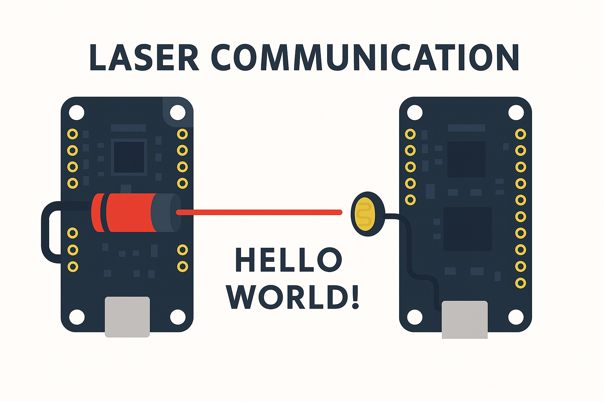
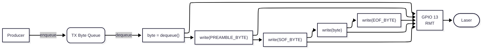
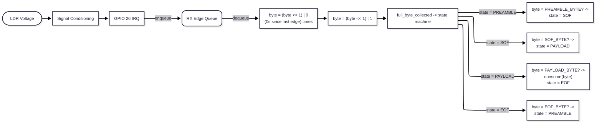
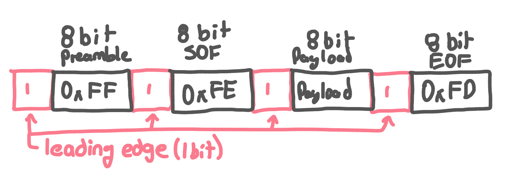
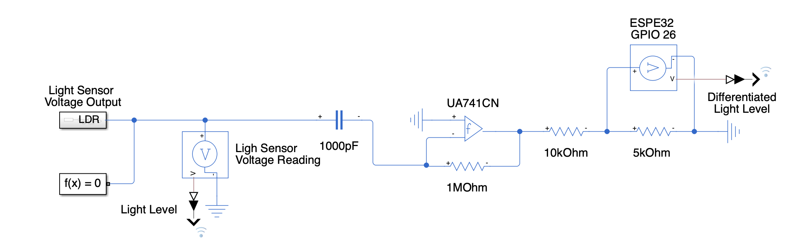
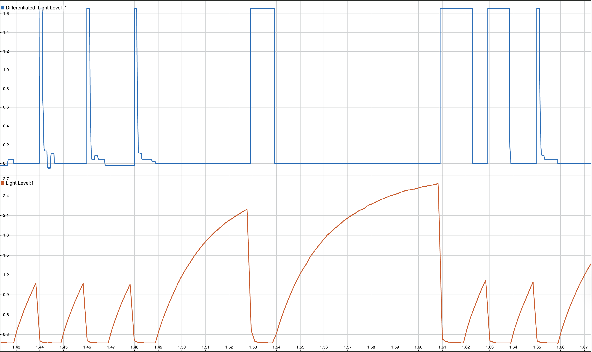
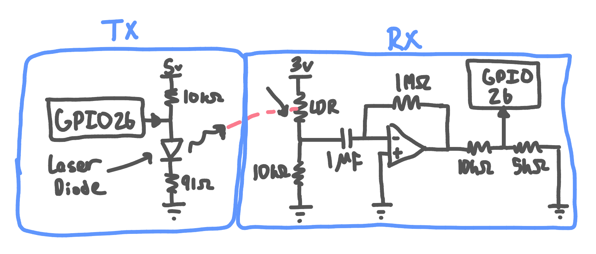

# Project Summary

## Executive Summary

I built a project that turns an ordinary laser pointer into a data link. Instead of sending information through wires or using radio waves, I used light as the medium of communication. A laser beam carried the data, and a light sensor on the other end turned those flashes back into digital information. I created a custom communication protocol with preamble detection, framing, and frequency/phase locking. On top of that, I modeled the system in MATLAB Simulink, tuned the analog circuits, and validated everything on hardware. The end result is a working proof‑of‑concept for laser‑based communication, built entirely from scavenged parts and creativity.

## Overview

*(Hardware setup)*

I started this project because I didn’t want all the material I studied for finals to just fade away. From my microcontrollers course, I pulled in concepts about hardware drivers and communication protocols. From sensors and instrumentation, I applied op amps and signal conditioning. From system modeling, I used Simulink to simulate the system with real-world measurements from an LDR receiving a laser signal.

Because my oscilloscope was limited—no data export and poor voltage accuracy—I used the ESP32 itself to capture samples and print them to the console. This let me tune capacitor and resistor values virtually and preview op amp outputs. The goal wasn’t to make a super useful device, but to show that I could create something functional with what I had on hand. That meant scavenging for an op amp, resistors, and capacitors rather than buying new parts. It was as much about resourcefulness as it was about engineering.

[Demo Video](https://www.youtube.com/watch?v=00r8lxy1KA8)

## Features / Objectives

* Send data by toggling a laser pointer on and off
* Build a custom asynchronous communication protocol (no separate clock line)
* Include preamble detection, frequency/phase lock, start bytes, payload, and end bytes
* Explore error detection like parity or Hamming encoding
* Handle recovery after signal interruptions
* Apply classroom knowledge of signal conditioning and system modeling
* Use MATLAB Simulink to simulate the system and optimize values
* Lay groundwork for eventually emulating UART over the laser link
* Lay groundwork for adding parity or hamming encoding

## System Architecture

The setup was kept simple and built from what I had:

* **Microcontroller**: Adafruit Feather V2 (ESP32-based)
* **Transmitter**: A basic laser pointer
* **Receiver**: Light Dependent Resistor (LDR)
* **Signal Conditioning**: Resistors, ceramic capacitors, and an op amp
* **Software Stack**: ESP-IDF with FreeRTOS, plus MATLAB Simulink for modeling
* **Protocol**: Custom asynchronous design tailored for laser transmission

## Implementation Details

I used two FreeRTOS tasks: one for TX and one for RX. For debugging they can run on the same board, but for actual operation TX and RX each run on separate ESP32s. Conditional compilation lets me switch roles easily.

**Transmission (TX):**

*(Transmission block diagram)*
* Uses the ESP32 RMT peripheral for precise timing (task scheduling wasn’t accurate enough).
* Implements Return-to-Zero (RZ) encoding: a rising edge means a 1, and 0s are inferred from timing gaps.
* Frames are structured with preamble, start byte, payload, and end byte.
* A FreeRTOS queue holds outgoing data. The TX task waits for new bytes, then encodes and transmits them.

**Reception (RX):**

*(Reception block diagram)*

*Note: state machine starts at PREAMBLE*
* Rising edges trigger interrupts. Timestamps are pushed into an ISR-safe FreeRTOS queue.
* The RX task runs a state machine that processes these timestamps.
* By comparing time gaps to the expected bit duration (from preamble), it reconstructs 0s between 1s.
* The state machine looks for preamble, start byte, payload, and end byte in order.

**Custom Protocol**

*(Data frame)*
The custom protocol I developed for the laser based communication.

**Design Choices:**

* RZ encoding was chosen because it works with just one op amp and avoids negative voltages.
* Carrier modulation was considered but ruled out—LDR response time is too slow.
* I avoided photodiodes on purpose to challenge myself with cleaning up a noisier LDR signal.

## Challenges and Solutions

**Challenge 1: Timing with FreeRTOS scheduling**
Scheduling jitter broke frequency lock.
**Solution:** Switched to RMT for precise GPIO toggling.

**Challenge 2: Noisy LDR signal**
Ambient light made it hard to tell 1s and 0s apart.
**Solution:** Used RZ encoding and only tracked rising edges, inferring zeros by timing.

**Challenge 3: Leading zeros problem**
Leading zeros can’t be decoded without a reference edge.
**Solution:** Forced every byte to start with a rising edge (9 bits/byte overhead).

**Challenge 4: Limited oscilloscope**
My scope couldn’t export or measure accurately.
**Solution:** Sampled with the Feather’s ADC (\~2000 samples/sec) and exported via serial into Simulink.

**Challenge 5: Laser alignment**
Hard to aim a 2 mm beam at a 5 mm LDR.
**Solution:** Taped both to a ruler for quick tests.

**Challenge 6: Small Bytes Unreliable**
Bytes < 128 were not received reliably due to larger required infering of zeros.

**Solution:** Added 128 to all sent bytes and subtracted 128 on the RX side.

**Challenge 6: Phase Recovery**
If a section of the message contains the preamble sequence (more likely than you would think) and we are no longer in sync, the byte boundaries will be incorrect and future data will be corrupt. 

**Solution:** Multiple preamble for lock. The more preambles for lock required the less likley the preamble sequence will be found in the message itself.  

**Challenge 7: Corrupted Message Recovery**
Corrupted messages (hand in front of beam for part of it) takes more than 1 preamble sequency to relock.

**Solution:** In progress

## Testing & Validation

**Simulation:**

*(Signal conditioning model)*
* Used Simscape with real LDR samples to test conditioning.
* Tuned op amp model to match my actual device.
* Validated that rising edges lined up as expected.
* Bit times (\~20 ms) gave enough tolerance for small inaccuracies.

*(Simulated LDR voltage vs conditioned output)*
**Note:** The laser turning on actually decreases the resistance of the LDR, which in a voltage divider results in a lower voltage. Since the differentiator is inverting, we are technically detecting falling edges of the raw LDR voltage. However, the op amp inversion flips these into rising edges, which makes it easier to conceptualize the system as reacting to rising edges when the laser turns on. Throughout this document, references to “rising edges” refer to these inverted signals.

**Hardware:**

* LED test: wired LED to op amp output, flashed it with a phone light, confirmed rising edge pulses.
* Debug mode: TX and RX on one board, printed raw bits/bytes/state machine.
* Full test: transmitted “Hello World!\n” and confirmed reception.
* Separate boards: final validation that TX and RX worked across devices.

## Constraints

* Only used parts on hand (no new purchases)
* Oscilloscope was limited: no export, poor accuracy, only useful for waveform shapes
* Stuck with ESP32 for capture and control
* Relied on just one op amp and basic passive components

## Future Improvements

* Add a better alignment method for longer distance
* Rethink framing: shrink preamble overhead, add parity or Hamming codes
* Improve protocol so every byte doesn’t need its own preamble/start/stop
* Use a photodiode with carrier modulation for faster data rates
* Implement Manchester encoding with a second op amp for proper edge detection and 8-bit frames

## Key Learnings

* Reinforced protocol design by building one from scratch
* Learned to use ESP32 RMT for precise bit timing
* Practiced analog signal conditioning with real-world noise
* Found creative workarounds for limited test equipment
* Gained experience making the most out of limited parts
* Followed a full workflow: hardware → embedded code → simulation

## Conclusion

This project turned my exam knowledge into a working prototype. By mixing microcontroller programming, analog signal conditioning, and system modeling, I created a simple but functional laser comms link. Even with limited tools and parts, I managed to send real data reliably. More than anything, this project shows adaptability, resourcefulness, and the ability to bring theory into practice.

*(Full system running in debug mode)*

## References

**Documentation & Datasheets:**

* [ESP-IDF RMT Peripheral Documentation](https://docs.espressif.com/projects/esp-idf/en/v4.3/esp32/api-reference/peripherals/rmt.html)
* [Texas Instruments UA741 Op Amp Datasheet](https://www.ti.com/lit/ds/symlink/ua741.pdf?ts=1756024765535)
* [Adafruit Feather ESP32 V2 Documentation](https://learn.adafruit.com/assets/123406)

**Relevant Courses:**

* MTE 325 (Microprocessor Systems and Interfacing) – protocol development
* MTE 351 (System Models) – Simulink/Simscape and MATLAB
* MTE 220 (Sensors and Instrumentation) – signal conditioning and circuit analysis

**Tools Used:**

* GPT-5 via Cursor
* GPT-5 via browser
* PlatformIO

## How to Build & Run

1. **Wire up the circuit:**

   * Connect the laser pointer to the TX board GPIO (through a transistor or driver circuit if required).
   * Build the receiver circuit with the LDR, op amp, resistors, and capacitors as described.
   
     *(Circuit diagram)*

2. **Set up PlatformIO:**

   * Open the project in [PlatformIO](https://platformio.org/) with VSCode.
   * Make sure the ESP32 Feather V2 environment is selected.

3. **Select TX or RX mode:**

   * The code uses conditional compilation flags in the config header to enable either transmitter or receiver.

4. **Build & upload:**

   * Via PlatformIO

5. **Run tests:**

   * In TX mode, queue up a message to send (e.g., "Hello World!").
   * In RX mode, monitor the serial output to see decoded bytes.
