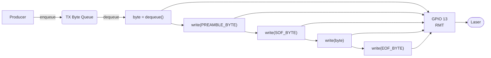
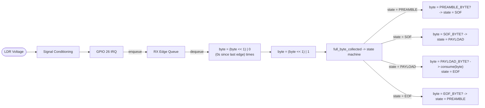
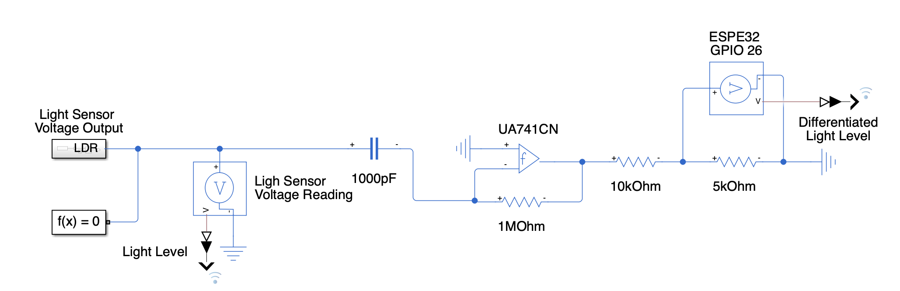
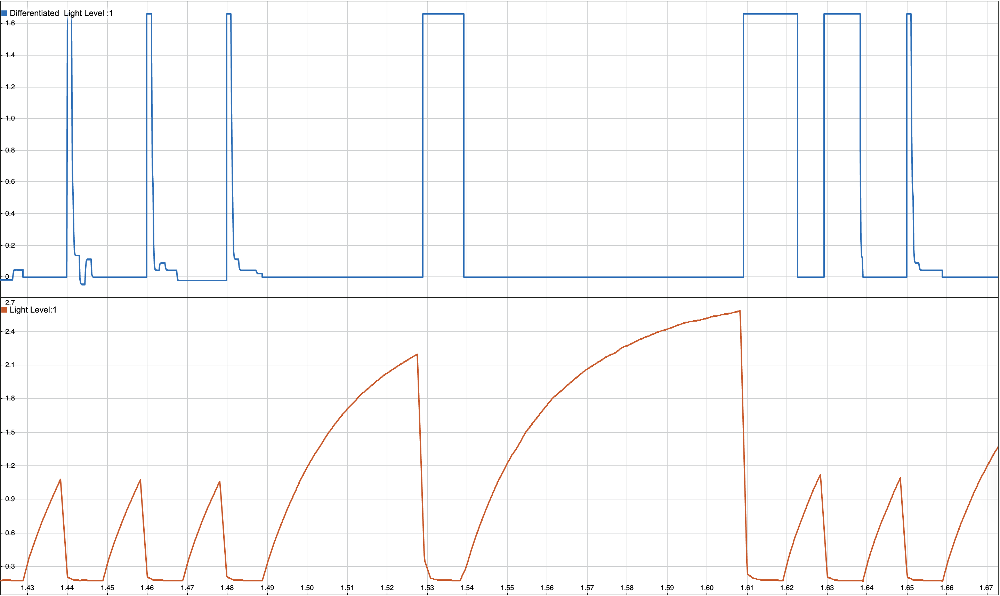

# Project Summary

## Executive Summary

I built a project that turns an ordinary laser pointer into a data link. Instead of sending information through wires or using radio waves, I used light as the medium of communication. A laser beam carried the data, and a light sensor on the other end turned those flashes back into digital information. I created a custom communication protocol with preamble detection, framing, and frequency/phase locking. On top of that, I modeled the system in MATLAB Simulink, tuned the analog circuits, and validated everything on hardware. The end result is a working proof‑of‑concept for laser‑based communication, built entirely from scavenged parts and creativity.

[Demo Video](https://youtu.be/lqTZRJkcThA)

---

## Overview

**(Hardware setup)**

**(Circuit Diagram)**

I started this project because I didn’t want all the material I studied for finals to just fade away. From my microcontrollers course, I pulled in concepts about hardware drivers and communication protocols. From sensors and instrumentation, I applied op amps and signal conditioning. From system modeling, I used Simulink to simulate the system with real-world measurements from an LDR receiving a laser signal.

Because my oscilloscope was limited—no data export and poor voltage accuracy—I used the ESP32 itself to capture samples and print them to the console. This let me tune capacitor and resistor values virtually and preview op amp outputs. The goal wasn’t to make a super useful device, but to show that I could create something functional with what I had on hand. That meant scavenging for an op amp, resistors, and capacitors rather than buying new parts. It was as much about resourcefulness as it was about engineering.

---

## Features / Objectives

* Send data by toggling a laser pointer on and off
* Build a custom asynchronous communication protocol (no separate clock line)
* Include preamble detection, frequency/phase lock, start bytes, payload, and end bytes
* Explore error detection like parity or Hamming encoding
* Handle recovery after signal interruptions
* Apply classroom knowledge of signal conditioning and system modeling
* Use MATLAB Simulink to simulate the system and optimize values
* Lay groundwork for eventually emulating UART over the laser link
* Lay groundwork for adding parity or hamming encoding

**Purely Technical Features:**

* Return-to-Zero encoding with configurable 14 ms bit period.

* Frame format: two 0xFF preamble bytes, 0xFE start-of-frame, length and payload bytes offset by 0x80, and 0xFD end-of-frame.

* RMT-based transmitter driving GPIO13.

* Interrupt-driven receiver on GPIO26 with 10 ms software debounce and frequency locking.

* Queue-based TX (`g_tx_queue`) and RX (`rx_edge_queue`) paths decoupled from application logic.

* Compile-time flags to enable/disable modules and debug logs.\\

## Design Limitations & Constraints

This project was shaped not only by engineering choices but also by practical constraints. These limitations influenced the design and in some ways made the project more interesting:

* **Oscilloscope restrictions** – The scope on hand could not export data and had limited accuracy, so I relied on the ESP32’s ADC to capture and log signals for analysis.
* **Minimal analog hardware** – With only one op amp available, I couldn’t build a Schmitt trigger or more advanced front-end circuitry. This forced me to detect only rising edges, rule out Manchester encoding, and infer zeros from timing gaps.
* **Photodiode instead of a full detector** – Using a bare photodiode meant the raw signal was noisy and unusable without conditioning. This limitation let me apply classroom knowledge of op amp signal conditioning in a very direct way.
* **No new parts allowed** – To stay true to the self‑imposed rule of resourcefulness, I scavenged components rather than purchasing. This made the project feel closer to a creative engineering challenge than a parts‑driven build.

---

## System Architecture

The setup was kept simple and built from what I had:

* **Microcontroller**: Adafruit Feather V2 (ESP32-based)
* **Transmitter**: A basic laser pointer
* **Receiver**: Light Dependent Resistor (LDR)
* **Signal Conditioning**: Resistors, ceramic capacitors, and an op amp
* **Software Stack**: ESP-IDF with FreeRTOS, plus MATLAB Simulink for modeling
* **Protocol**: Custom asynchronous design tailored for laser transmission

**Hardware Pins:**

| Pin    | Direction | Function                                   |
| ------ | --------- | ------------------------------------------ |
| GPIO13 | Output    | Laser/LED driver (RMT channel)             |
| GPIO26 | Input     | Light sensor edge capture (GPIO interrupt) |

---

## Implementation Details

I used two FreeRTOS tasks: one for TX and one for RX. For debugging they can run on the same board, but for actual operation TX and RX each run on separate ESP32s. Conditional compilation lets me switch roles easily.

### Transmission (TX)




**(Transmission block diagram)**

* Uses the ESP32 RMT peripheral for precise timing (task scheduling wasn’t accurate enough).
* Implements Return-to-Zero (RZ) encoding: a rising edge means a 1, and 0s are inferred from timing gaps.
* Frames are structured with preamble, start byte, payload, and end byte.
* A FreeRTOS queue holds outgoing data. The TX task waits for new bytes, then encodes and transmits them.

### Reception (RX)



**(Reception block diagram)**

* Rising edges trigger interrupts. Timestamps are pushed into an ISR-safe FreeRTOS queue.
* The RX task runs a state machine that processes these timestamps.
* By comparing time gaps to the expected bit duration (from preamble), it reconstructs 0s between 1s.
* The state machine looks for preamble, start byte, payload, and end byte in order.

**Protocol Frame:**


**(Data frame)**

---

## Challenges and Solutions

**Challenge 1: Timing with FreeRTOS scheduling**
Scheduling jitter broke frequency lock.
**Solution:** Switched to RMT for precise GPIO toggling.

**Challenge 2: Noisy LDR signal**
Ambient light made it hard to tell 1s and 0s apart.
**Solution:** Used RZ encoding and only tracked rising edges, inferring zeros by timing.

**Challenge 3: Leading zeros problem**
Leading zeros can’t be decoded without a reference edge.
**Solution:** Forced every byte to start with a rising edge (9 bits/byte overhead).

**Challenge 4: Limited oscilloscope**
My scope couldn’t export or measure accurately.
**Solution:** Sampled with the Feather’s ADC (\~2000 samples/sec) and exported via serial into Simulink.

**Challenge 5: Laser alignment**
Hard to aim a 2 mm beam at a 5 mm LDR.
**Solution:** Taped both to a ruler for quick tests.

**Challenge 6: Small Bytes Unreliable**
Bytes < 128 were not received reliably due to larger required inferring of zeros.
**Solution:** Added 128 to all sent bytes and subtracted 128 on the RX side.

**Challenge 7: Phase Recovery**
If a section of the message contains the preamble sequence (more likely than you would think) and we are no longer in sync, the byte boundaries will be incorrect and future data will be corrupt.
**Solution:** Multiple preamble for lock. The more preambles for lock required the less likely the preamble sequence will be found in the message itself.

**Challenge 8: Corrupted Message Recovery**
Corrupted messages (hand in front of beam for part of it) takes more than 1 preamble sequence to relock.
**Solution:** In progress

---

## Testing & Validation

### Simulation


**(Signal conditioning model)**

* Used Simscape with real LDR samples to test conditioning.
* Tuned op amp model to match my actual device.
* Validated that rising edges lined up as expected.


**(Simulated LDR voltage vs conditioned output)**

### Hardware

* LED test: wired LED to op amp output, flashed with a phone light.
* Debug mode: TX and RX on one board.
* Full test: transmitted “Hello World!\n”.
* Separate boards: validated across devices.

**Expected Logs:**

```
LASER_TX: Sending byte 0x88
LASER_RX: Preamble byte found
LASER_RX: Received payload: Hello World!
```

---

## Constraints

* Only used parts on hand (no new purchases)
* Oscilloscope limited
* Stuck with ESP32
* Relied on one op amp + passives

---

## Configuration

All tuning parameters live in `Embedded/src/defines.hpp`.

| Macro                     | Default | Purpose                     |
| ------------------------- | ------- | --------------------------- |
| `BIT_MS`                  | 14      | Bit duration (ms)           |
| `RX_DEBOUNCE_US`          | 10000   | Minimum edge spacing (µs)   |
| `FREQUENCY_TOLERANCE_US`  | 4000    | Lock window (µs)            |
| `MAX_PAYLOAD_LENGTH`      | 128     | Bytes per frame             |
| `PREAMBLE_REPS`           | 2       | Preamble bytes              |
| `PREAMBLE_BYTE`           | `0xFF`  | Preamble value              |
| `START_OF_FRAME_BYTE`     | `0xFE`  | SOF marker                  |
| `END_OF_FRAME_BYTE`       | `0xFD`  | EOF marker                  |
| `ENABLE_RX` / `ENABLE_TX` | 1       | Compile-time role selection |
| `DEBUG_RX` / `DEBUG_TX`   | 0       | Verbose logging             |
| `RMT_RESOLUTION_HZ`       | 1 MHz   | RMT clock resolution        |

---

## Future Improvements

* Add a better alignment method for longer distance
* Shrink preamble overhead
* Add parity/Hamming codes
* Consider photodiode + carrier modulation
* Explore Manchester encoding

---

## Key Learnings

* Reinforced protocol design by building one from scratch
* Learned ESP32 RMT for bit timing
* Practiced analog conditioning with noise
* Creative workarounds for limited test gear
* Followed full workflow: hardware → embedded code → simulation

---

## Conclusion

This project turned my exam knowledge into a working prototype. By mixing microcontroller programming, analog signal conditioning, and system modeling, I created a simple but functional laser comms link. Even with limited tools and parts, I managed to send real data reliably. More than anything, this project shows adaptability, resourcefulness, and the ability to bring theory into practice[.](https://docs.espressif.com/projects/esp-idf/en/v4.3/esp32/api-reference/peripherals/rmt.html)

\*\*[(Full system running in debug mod](https://docs.espressif.com/projects/esp-idf/en/v4.3/esp32/api-reference/peripherals/rmt.html)\*\***e)**

---

## [References](https://www.ti.com/lit/ds/symlink/ua741.pdf)

* [ESP-IDF RMT Peripheral Do](https://www.ti.com/lit/ds/symlink/ua741.pdf)[cume](https://docs.espressif.com/projects/esp-idf/en/v4.3/esp32/api-reference/peripherals/rmt.html)[ntation](https://learn.adafruit.com/assets/123406)
* [Texas Instruments UA741 Op A](https://learn.adafruit.com/assets/123406)[mp Datasheet](https://www.ti.com/lit/ds/symlink/ua741.pdf)
* [Adafruit Feather ESP32 V2 Documentation](https://learn.adafruit.com/assets/123406)

**Relevant Courses:**

* MTE 325 – protocol development
* MTE 351 – Simulink/Simscape
* MTE 220 – signal conditioning

**Tools Used:**

* GPT-5 via Cursor & browser
* PlatformIO

---

## How to Build & Run

1. **Wire up the circuit:**

   * Connect the laser pointer to GPIO13.
   * Build the receiver with LDR + op amp.
   * **(Circuit diagram)**

2. **Set up PlatformIO:**

   * Open in VSCode, select Feather V2.

3. **Select TX or RX mode:**

   * Use config flags in header.

4. **Build & upload:**

   * `pio run -t upload`

5. **Run tests:**

   * TX queues messages, RX decodes serial output.
